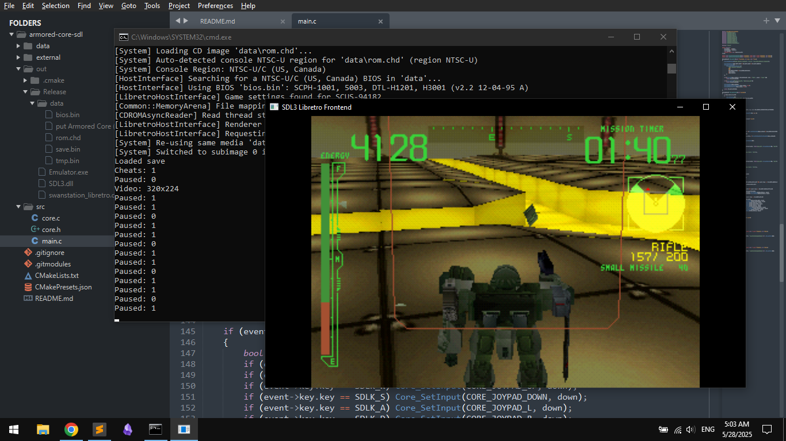

*Armored Core 1 running perfectly in emulator.*

---

This is an unfinished but working SDL3 [libretro][libretro] frontend that also updates in-game 
memory to enable mouse look in [Armored Core 1][ac] as it is done in 
[MouseInjectorDolphinDuck][injector]. It uses [Swanstation][swanstation] as libretro core.

Before compiling the emulator, ensure you have a C compiler, [CMake][cmake], [Python][py] and 
[Ninja][ninja]. Put any PSX bios (`SCPH1001.BIN` for example) and Armored Core `.chd` ROM files into
`data/` folder. Rename AC ROM to `rom.chd`.

Build and run the project with the following command:
```bat
cmake --preset main && cmake --build --preset Release && out\Release\Emulator.exe
```

Or you can download the [latest binary release][release].

### Controls
- `Escape` - lock/unlock mouse
- `1` - toggle mouse look (ON by default)
- `2` - save game state (automatically saved to `data/save.bin` on shutdown)
- `3` - load game state (automatically loaded on startup)
- `F` - toggle fullscreen mode
- `Backslash` - pause/resume the game (paused on focus loss anyway)
- `Left Arrow`, `Right Arrow` - go left/right in menus
- `W`, `S` - move forward/backwards, go up/down the menu
- `A`, `D` - strafe
- `X` - melee, return from menu
- `Space` - jump/thrusters, select menu option
- `Enter` - START
- `Backspace` - SELECT
- `LMB` - fire
- `RMB` - switch guns

[libretro]: https://www.libretro.com/
[ac]: https://en.wikipedia.org/wiki/Armored_Core_(video_game)
[injector]: https://github.com/garungorp/MouseInjectorDolphinDuck/blob/master/games/ps1_acore.c
[swanstation]: https://github.com/libretro/swanstation
[cmake]: https://cmake.org/
[py]: https://www.python.org/downloads/
[ninja]: https://pypi.org/project/ninja/
[release]: https://github.com/xfnty/armored-core-sdl/releases/tag/latest
